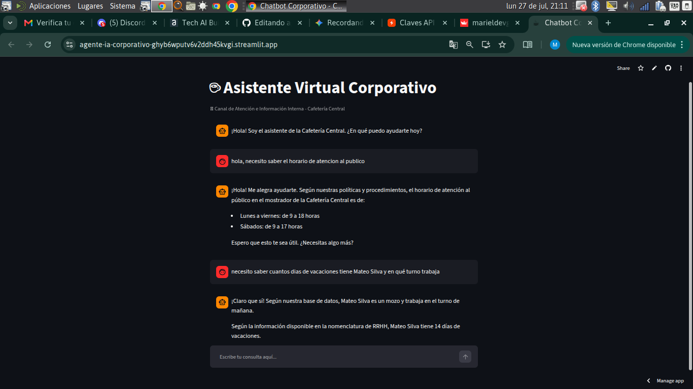

# ☕ Agente Virtual Corporativo - Cafetería Central

🌐 **Acceso Directo al Agente Virtual (Demo en Vivo):**  
👉 [https://agente-ia-corporativo-ghyb6wputv6v2ddh45kvgi.streamlit.app/](https://agente-ia-corporativo-ghyb6wputv6v2ddh45kvgi.streamlit.app/)

---

## 📸 Evidencia de Funcionamiento (Prueba de Ejecución)

---

## 📋 Descripción del Proyecto y Cumplimiento del Desafío

Este proyecto consiste en el desarrollo de un **Agente Virtual Inteligente** diseñado para actuar como un canal de atención unificado tanto para clientes externos como para personal interno (Recursos Humanos, Operaciones y dueños) de la **Cafetería Central**.

El agente fue construido integrando el motor de inferencia de **Groq** con el modelo LLM de código abierto de última generación **Llama 3.1 8B Instant**, desplegado sobre una interfaz web interactiva con **Streamlit Cloud**.

---

## 🎯 Cumplimiento de Requisitos del Desafío

### 1. Comprensión Semántica Multi-Dialectal (Flexibilidad de Lenguaje)
* **Requisito:** Interpretación de intención sin requerir coincidencias exactas de texto.
* **Implementación:** El agente comprende modismos, expresiones informales y regionalismos de toda Latinoamérica (ej. *"¿Cuándo cobro la del diablo/aguinaldo?"*, *"Me siento re mal, no voy a laburar hoy"*, *"¿A qué hora abren el boliche?"*). El sistema interpreta la intención subyacente y responde con información precisa de los manuales de la empresa.

### 2. Consolidación e Integración Multi-Fuente
* **Requisito:** Procesamiento estructurado y no estructurado de diversas fuentes de información.
* **Implementación:** El backend lee, procesa y unifica automáticamente tres fuentes independientes en cada consulta:
  1. **`datos_empresa.csv`**: Preguntas frecuentes comerciales y atención al cliente (horarios, productos).
  2. **`protocolo_operaciones.txt`**: Manual de procedimientos operativos (limpieza, seguridad, aviso de ausencias, aguinaldo, vacaciones).
  3. **`empleados_rh.json`**: Registro estructurado de la nómina de empleados (roles, turnos, días de vacaciones y contacto de RRHH).

### 3. Tono Educado, Profesional y Empático
* **Requisito:** Respuestas cordiales adaptadas a un entorno corporativo.
* **Implementación:** A través de un Prompt de Sistema minuciosamente ajustado, el asistente mantiene un lenguaje sumamente respetuoso, resolutivo y profesional, sin perder la cercanía con el colaborador o cliente.

### 4. Manejo de Ambigüedades y Ausencia de Información
* **Requisito:** Gestión inteligente de consultas dudosas o fuera de alcance.
* **Implementación:**
  * Ante **preguntas ambiguas**, el agente responde amablemente con la información que intuye y solicita confirmación o reformulación al usuario.
  * Ante **consultas sin respuesta en las bases de datos**, el agente reconoce respetuosamente no disponer de la información y deriva automáticamente la consulta al Departamento de Recursos Humanos (`rrhh@cafeteria.com`).

---

## 🛠️ Arquitectura Técnica del Sistema

* **Usuario (Interfaz Web):** Cliente o Colaborador en Streamlit Cloud.
* **Backend de Aplicación (`agente.py`):** Motor Streamlit que realiza la lectura y consolidación dinámica del CSV, TXT y JSON en tiempo real.
* **Modelo LLM de Inferencia:** Groq API ejecutando Llama 3.1 8B Instant con temperatura 0.3 para respuestas precisas.

---

## 🚀 Características y Capacidades Clave

* **Consultas de Clientes:** Horarios de atención en mostrador (Lunes a Viernes de 9 a 18 hs, Sábados de 9 a 17 hs) y productos.
* **Gestión de Ausencias por Salud:** Notificación obligatoria a RRHH o supervisor dentro de las primeras 3 horas de iniciado el turno, exigiendo certificado médico con diagnóstico y alta para la reincorporación.
* **Fechas de Cobro de Aguinaldo (SAC):** Confirmación del cobro del primer medio aguinaldo en la última jornada laboral de junio y el segundo antes del 18 de diciembre.
* **Turnos de Trabajo y Nómina:** Consulta de horarios de turnos (Mañana, Tarde, Sábados rotativos) y roles del personal activo.
* **Solicitud de Vacaciones:** Procedimiento para solicitar vacaciones con 30 días de anticipación (período de goce entre Octubre y Abril).

---

## 🔧 Instalación y Ejecución Local

Para ejecutar y probar este repositorio en un entorno local:

1. **Clonar el repositorio:**
   `git clone https://github.com/MarielDevGrowth/agente-ia-corporativo.git`
   `cd agente-ia-corporativo`

2. **Instalar dependencias requeridas:**
   `pip install -r requirements.txt`

3. **Configurar la clave de API (Groq API Key):**
   `export GROQ_API_KEY="tu_clave_de_groq_aqui"`

4. **Ejecutar la aplicación con Streamlit:**
   `streamlit run agente.py`

---

## 📁 Estructura del Repositorio

* **`.devcontainer/devcontainer.json`**: Configuración para entornos de desarrollo como GitHub Codespaces.
* **`agente.py`**: Código fuente principal (interfaz Streamlit, lectura multi-fuente y conexión con Groq).
* **`datos_empresa.csv`**: Fuente 1 (Preguntas frecuentes comerciales y datos del negocio).
* **`protocolo_operaciones.txt`**: Fuente 2 (Procedimientos operativos, normas e instructivos).
* **`empleados_rh.json`**: Fuente 3 (Nómina de personal, puestos, turnos y vacaciones).
* **`requirements.txt`**: Dependencias de librerías Python (`streamlit` y `groq`).
* **`captura_pantalla.png`**: Captura de prueba de funcionamiento.
* **`README.md`**: Documentación pública y técnica del proyecto.
